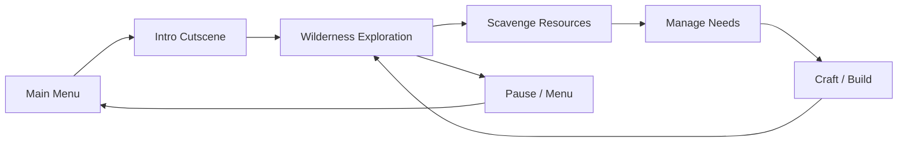

# Product Requirements Document — Survive Flight 377

**Version:** 1.0  
**Last updated:** June 23, 2026  
**Status:** Early prototype  
**Engine:** Godot 4.7 (Forward Plus, Jolt Physics)

---

## 1. Executive Summary

**Survive Flight 377** is a first-person survival game that opens with a cinematic plane-crash sequence aboard a commercial airliner. The player survives the crash and must explore, scavenge, and endure in the wilderness. The project is in an early prototype stage: core menus, an intro cutscene, and first-person locomotion are implemented; survival systems and a crash-site world are not yet built.

---

## 2. Product Vision

Deliver a tense, story-driven survival experience that begins in a confined, high-stakes moment (a failing passenger flight) and transitions into open-ended wilderness survival. The intro should establish stakes and atmosphere; gameplay afterward should reward exploration, resourcefulness, and persistence.

**Elevator pitch:** *You were a passenger on Flight 377 when the engines failed. You woke up alone in the wilderness. Scavenge the wreckage, fight the elements, and survive.*

---

## 3. Goals & Success Metrics

| Goal | Description | Success Indicator |
|------|-------------|-------------------|
| Immersive opening | Hook players with a memorable crash intro | Players complete intro without skipping; positive playtest feedback on tension |
| Responsive controls | FPS movement feels smooth and intentional | Walk, sprint, jump, and look work reliably at 60 FPS on target hardware |
| Clear game flow | Menu → intro → gameplay → pause → menu works end-to-end | No broken state transitions in normal play |
| Survival depth (future) | Meaningful choices around food, shelter, and health | Players engage with at least 3 survival systems per session |

---

## 4. Target Audience

- **Primary:** Players who enjoy narrative survival games (e.g., *The Forest*, *Subnautica*, *Green Hell*)
- **Secondary:** Fans of disaster/survival fiction and first-person exploration
- **Platform:** PC (Windows), 1920×1080 viewport, keyboard + mouse

---

## 5. User Stories

### Implemented

| ID | As a player, I want to… | So that… | Status |
|----|-------------------------|----------|--------|
| US-01 | See a main menu with Start and Quit | I can begin or exit the game | Done |
| US-02 | Experience a plane-crash intro from my seat | I understand the premise and feel tension | Done |
| US-03 | Look around the cabin during the intro | I feel present in the scene | Done |
| US-04 | Hear captain announcements before impact | The story is clear without reading lore | Done (text only; no audio yet) |
| US-05 | Walk, sprint, jump, and look around after the intro | I can explore the world | Done |
| US-06 | Pause and resume gameplay | I can take breaks | Done |
| US-07 | Return to the main menu from pause | I can restart without quitting the app | Done |

### Planned

| ID | As a player, I want to… | So that… | Priority |
|----|-------------------------|----------|----------|
| US-08 | Wake up at a crash site with plane wreckage | The intro connects to gameplay | P0 |
| US-09 | Manage hunger, thirst, and health | Survival has stakes | P0 |
| US-10 | Scavenge items from the wreckage | I have resources to survive | P0 |
| US-11 | Craft basic tools and shelter | I can progress and endure longer | P1 |
| US-12 | Experience weather and day/night cycles | The wilderness feels alive and threatening | P1 |
| US-13 | Encounter wildlife (threats and food) | Exploration has risk and reward | P2 |
| US-14 | Uncover story clues about the crash and other survivors | The narrative continues beyond the intro | P2 |

---

## 6. Core Gameplay Loop



**Current loop (prototype):** Main Menu → Intro Cutscene → Open wilderness movement → Pause → Resume or Return to Menu.

**Target loop (full game):** Survive time pressure from needs and environment while exploring the crash site and surrounding wilderness, converting found resources into tools, shelter, and story progress.

---

## 7. Feature Specification

### 7.1 Main Menu

- Title: **Survive Flight 377**
- Background image (`assets/menu_background.png`)
- Actions: **Start Game**, **Quit**
- Mouse visible; no gameplay input until Start is pressed

### 7.2 Intro Cutscene — Flight 377

**Setting:** Commercial airplane cabin, 9 rows, 3 seats per side (6-abreast), aisle down the center. Player is seated in row 2, window seat (right side). A neighbor passenger sits in the adjacent seat.

**Sequence:**

1. Fade in from black; player is seated with limited head look (yaw ±0.55 rad, pitch ±0.35 rad)
2. **10 seconds** of free look around the cabin
3. Captain announcements (on-screen dialogue):
   - *"Ladies and gentlemen, this is your captain speaking."*
   - *"We have lost engine power. The aircraft is going down."*
   - *"Brace for impact!"*
4. **2.8 seconds** of violent cabin shake (camera position and rotation jitter)
5. **2 seconds** fade to black
6. Transition to gameplay world; player gains full FPS control

**Cabin details (built procedurally):** seats, windows with emissive glass, overhead bins, aisle carpet, bulkhead, cabin lighting.

### 7.3 Player Character

| Attribute | Value |
|-----------|-------|
| Type | `CharacterBody3D`, first-person |
| Walk speed | 5.0 m/s |
| Sprint speed | 8.5 m/s |
| Jump velocity | 4.5 m/s |
| Mouse sensitivity | 0.002 |
| Camera | Head-mounted with walk/sprint bob (sway, vertical bounce, roll) |
| Collision | Capsule (radius 0.4, height 1.8) |

**Controls:**

| Action | Input |
|--------|-------|
| Move | W / A / S / D |
| Jump | Space |
| Sprint | Shift |
| Look | Mouse |
| Pause | Escape |

### 7.4 Game World (Current)

- **Environment:** Crash-site wilderness (`crash_site.tscn`) — 120×120 m forest terrain with fuselage wreckage, wing fragment, scattered debris, conifer trees, and an abandoned ranger station
- **Spawn:** Player at (0, 1, 5) near the fuselage wreckage
- **Legacy:** `baseplate.tscn` retained as minimal placeholder; no longer used in `main.tscn`
- **Note:** Models are procedural placeholders with realistic proportions; see `docs/model-build-guide.md` for high-poly replacement specs

### 7.5 Pause Menu

- Semi-transparent overlay
- **Resume** — restore gameplay and capture mouse
- **Return to Menu** — reload main scene (full reset)

### 7.6 Survival Systems (Planned)

| System | Description |
|--------|-------------|
| Health | Damage from falls, wildlife, exposure; healing via items |
| Hunger | Decreases over time; restored by food |
| Thirst | Decreases faster than hunger; restored by water |
| Temperature | Affected by weather, time of day, clothing, fire |
| Inventory | Limited slots; items from wreckage and environment |
| Crafting | Combine resources into tools, weapons, shelter pieces |
| Day/night | Time progression affecting visibility and temperature |
| Weather | Rain, wind, cold — impacts movement and needs |

---

## 8. Narrative Overview

**Act I — The Flight (implemented):** Flight 377 loses engine power. The captain warns passengers to brace for impact. The screen fades to black at the moment of crash.

**Act II — The Wreckage (planned):** The player regains consciousness near scattered debris in a remote wilderness area. Evidence suggests few, if any, other survivors.

**Act III — Survival (planned):** Days turn into weeks. The player must secure shelter, food, and water while optionally investigating the crash and searching for signs of life.

**Tone:** Grounded, tense, and solitary. Not horror-focused, but urgency and isolation are central.

---

## 9. Technical Requirements

| Area | Specification |
|------|---------------|
| Engine | Godot 4.7 |
| Rendering | Forward Plus, D3D12 (Windows) |
| Physics | Jolt Physics (3D) |
| Resolution | 1920×1080, viewport stretch, expand aspect |
| Architecture | Scene-based: `main.tscn` orchestrates menu, intro, world, pause |
| Key scenes | `main_menu`, `intro_cutscene`, `airplane_cabin`, `player`, `baseplate`, `pause_menu` |
| Key scripts | `main.gd`, `intro_cutscene.gd`, `airplane_cabin.gd`, `player.gd`, `main_menu.gd`, `pause_menu.gd` |
| Signals | `game_started`, `intro_finished`, `resume_pressed`, `return_to_menu_pressed` |

---

## 10. Art & Audio Direction

### Visual (current)

- Procedural realistic meshes built in code (`MeshFactory`, model builder scripts)
- Narrow-body airplane cabin with detailed seats, PSU panels, reading lights, and seated passengers
- Crash-site fuselage wreck, wing fragment, forest trees, abandoned log ranger station
- PBR-style materials: fabric, metal, plastic, glass, skin tones with appropriate roughness/metallic
- Physical sky with warm sun and atmospheric fog
- **Model specs:** `docs/model-build-guide.md` — dimensions, materials, Blender steps, export paths

### Visual (target)

- Replace procedural placeholders with authored `.glb` assets per model build guide
- Crash-site debris field integrated into forested wilderness (in progress)
- Improved vegetation, terrain sculpting, and weather VFX
- Consistent low-to-mid poly style with readable silhouettes

### Audio (not yet implemented)

- Cabin ambience (engine hum, murmur) during intro
- Captain PA voice or radio-filtered TTS for announcements
- Impact sound and sudden silence
- Wilderness ambience, weather, footsteps, and UI feedback

---

## 11. Roadmap & Milestones

### Milestone 1 — Foundation ✅ (Current)

- [x] Main menu and pause flow
- [x] Airplane cabin intro cutscene with dialogue and shake
- [x] First-person locomotion with camera bob
- [x] Placeholder outdoor environment

### Milestone 2 — Crash Site (In Progress)

- [x] Crash-site level replacing flat baseplate (`crash_site.tscn`)
- [x] Wreckage props (fuselage, wing, scattered luggage/seats)
- [x] Wilderness buildings (abandoned ranger station) and forest trees
- [x] Player spawn at crash site near wreckage
- [x] Model build guide with dimensions and art specs (`docs/model-build-guide.md`)
- [ ] Basic interact system (pick up, examine)
- [ ] Post-crash wake-up vignette after intro fade

### Milestone 3 — Core Survival

- [ ] Hunger, thirst, and health UI and logic
- [ ] Inventory and item definitions
- [ ] Basic crafting (campfire, bandage, simple tool)
- [ ] Day/night cycle

### Milestone 4 — World Life

- [ ] Weather system
- [ ] Wildlife (passive and hostile)
- [ ] Expanded map beyond crash site
- [ ] Environmental storytelling (logs, belongings, flight manifest)

### Milestone 5 — Polish & Ship

- [ ] Audio pass (music, SFX, voice)
- [ ] Settings menu (sensitivity, volume, graphics)
- [ ] Save/load
- [ ] Playtesting and balance pass

---

## 12. Out of Scope (v1.0)

- Multiplayer / co-op
- Full airline simulation or flight mechanics
- Large open-world streaming
- Mobile or console ports
- Microtransactions or live-service features

---

## 13. Risks & Dependencies

| Risk | Mitigation |
|------|------------|
| Intro cutscene may feel disconnected from empty baseplate | Prioritize Milestone 2 crash-site level immediately after intro |
| Survival scope creep | Ship Milestone 3 with 3 needs + 5 craftable items before expanding |
| No audio reduces immersion | Add minimal SFX in Milestone 2 even if music/voice wait |
| Single-scene reload for menu reset | Acceptable for prototype; consider persistent game state later |

---

## 14. Open Questions

1. **Setting:** What biome surrounds the crash (temperate forest, mountains, tundra)?
2. **Survivors:** Is the neighbor passenger alive and findable, or a narrative red herring?
3. **Win condition:** Open-ended survival, escape/rescue objective, or story chapter finale?
4. **Difficulty:** Realistic hard survival vs. accessible casual survival?
5. **Perspective lock:** Remain strictly first-person, or allow optional third-person?

---

## 15. Appendix — Project Structure

```
survival-game/
├── assets/
│   └── menu_background.png
├── docs/
│   └── model-build-guide.md   # Realistic model specs for artists
├── scenes/
│   ├── main.tscn              # Root scene (world, menus, intro)
│   ├── main_menu.tscn
│   ├── intro_cutscene.tscn
│   ├── airplane_cabin.tscn
│   ├── airplane_seat.tscn
│   ├── passenger.tscn
│   ├── player.tscn
│   ├── crash_site.tscn        # Wilderness + wreckage + buildings
│   ├── baseplate.tscn         # Legacy placeholder
│   └── pause_menu.tscn
├── scripts/
│   ├── main.gd
│   ├── main_menu.gd
│   ├── intro_cutscene.gd
│   ├── airplane_cabin.gd
│   ├── airplane_seat_model.gd
│   ├── passenger_model.gd
│   ├── crash_site.gd
│   ├── mesh_factory.gd
│   ├── player.gd
│   └── pause_menu.gd
└── project.godot
```
